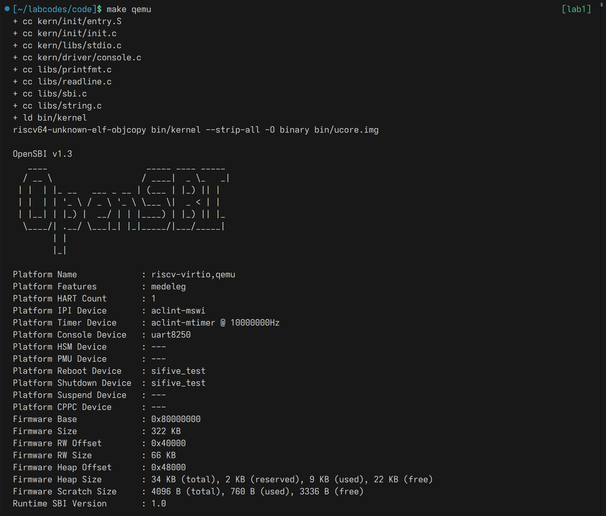
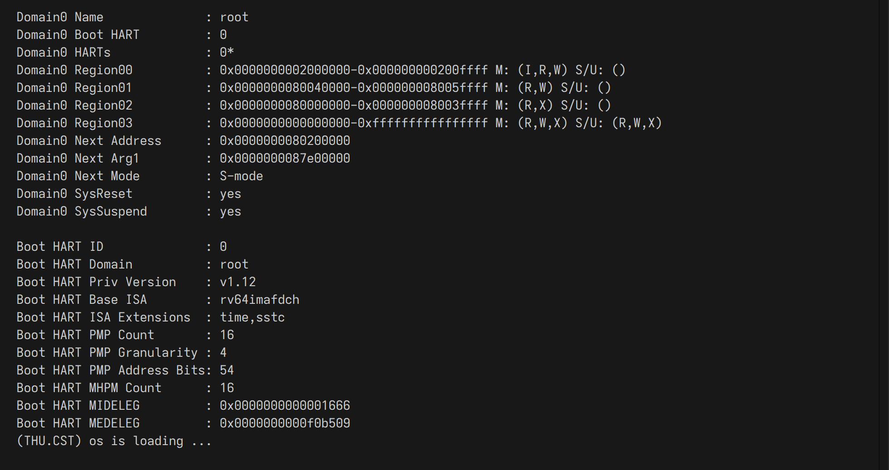
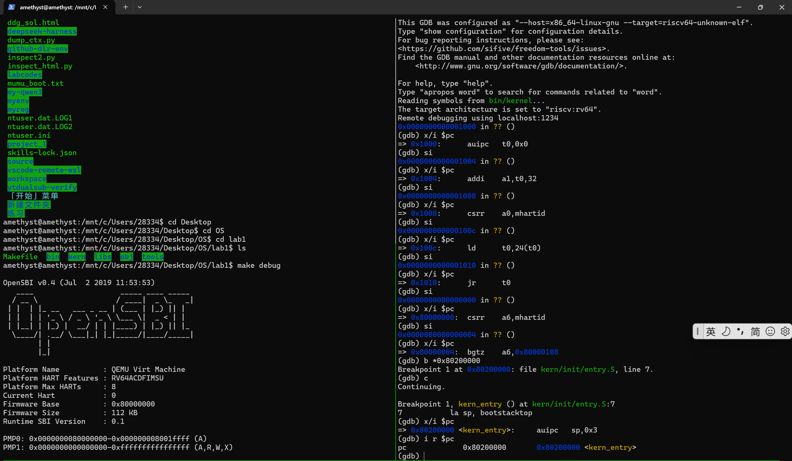

# 实验报告

## 实验基本信息

| 项目 | 内容 |
|------|------|
| **实验名称** | Lab 1: 最小可执行内核 |
| **小组成员** | 2513628-乐嘉文、2511676-孙家昊、2510777-朱万旭 |
| **完成日期** | 2026-09-25 |

### 小组分工

| 成员 | 负责的练习/模块 | 负责的实验报告部分 |
|------|----------------|-----------|
| 2513628-乐嘉文 | 编译运行模块（Makefile） | 实验目的、逻辑分析、内容实现、测试、总结|
| 2511676-孙家昊 | 练习1：内核入口指令分析 | 练习1：理解内核启动中的程序入口操作 |
| 2510777-朱万旭 | 练习2:熟悉QEMU与GDB的调试方法 |练习2:使用GDB验证启动流程 |

---

## 一、实验目的

<!-- 说明本次实验的主要目标和预期成果 -->

本实验的主要目的是：

1. 理解操作系统怎么启动
2. 学会用 QEMU + GDB 调试 
3. 实现最基本的输出和调试手段

---

## 二、实验环境

<!-- | 成员 | AI 编程工具 | 底层模型 | 备注 |
|------|------------|---------|------|
| 学号1-姓名1 | [例如：Cline（VS Code插件） / Claude Code（终端 Agent） / DeepSeek Harness等] | [例如：Claude Sonnet 4.5 / GPT-5.5 / DeepSeek-V4-Flash等] | [可选：特殊配置等] |
| 学号2-姓名2 | | | |
| 学号3-姓名3 | | | | -->

| 成员 | AI 编程工具 | 底层模型 | 备注 |
|------|------------|---------|------|
| 2513628-乐嘉文 | DeepSeek Harness | DeepSeek-V4.1-Flash | |
| 2511676-孙家昊 | Codex | gpt6-sol | |
| 2510777-朱万旭 | Codex| GPT6.1-sol | |

**说明：**
- **AI 编程工具**：指具体使用的终端工具、编辑器插件、桌面应用或浏览器界面
- **底层模型**：指该工具使用的大语言模型及版本

---

## 三、实验整体逻辑分析

### 2.1 本章节的逻辑主线

<!-- [请用自己的话描述本章实验的核心主线，例如：
- 本章围绕哪个核心主题展开？（例如：用户进程管理、虚拟内存、文件系统等）
- 整个实验解决什么问题？（例如：如何让用户程序运行在操作系统之上）] -->

核心主题：内核启动
实验解决的问题：如何让 ucore 内核从加电开始，经过固件引导，成功运行起来

### 2.2 功能的逐步实现

<!-- [说明本章实验是按照什么顺序逐步实现各个功能的，以及为什么要按这个顺序，例如：

1. 首先实现**功能A** → 为什么首先实现这个？（例如：建立系统调用接口是后续所有用户态功能的基础）
2. 接着再完善**功能B** → 为什么接着实现这个？（例如：有了系统调用后，需要能够加载和启动第一个用户进程）
3. 然后完成**功能C** → 为什么然后实现这个？（例如：有了第一个进程后，需要实现进程复制功能）
4. 最后补充了**功能D** → 为什么最后实现这个？（例如：最后完善进程退出和清理机制，形成完整闭环）] -->

首先实现内核启动，然后实现实现串口输出与基本打印，有利于观察内核运行状态，调试后续功能。

---

## 四、实验内容与实现

<!-- 
说明：本部分按照 exercises 文档中的练习顺序组织
每个功能模块或者练习中可能包含多项任务，请根据实际情况调整
-->

### 功能模块：内核启动与初始化

**负责人：** 2513628-乐嘉文

<!-- #### 模块功能描述

**需要实现/修改的函数：**

```c
// 列出本模块涉及的所有函数签名
void example_function(void);
int another_function(int arg);
``` -->

**功能说明：**
该模块负责让 ucore 从加电状态进入 C 语言运行环境，是整个内核运行的第一步。

<!-- #### 最终提示词

以下是经过迭代优化后，最终成功实现该功能的提示词：

````markdown

[按照提示词模板，给出具体的提示词]

````

#### 实现迭代过程

本模块的实现经历了 [N] 次迭代，过程如下：

---

##### 第一次迭代

如果设计的prompt生成代码后出现问题：

**遇到的问题：**
- 问题1：问题描述、错误信息和原因分析
- 问题2：问题描述、错误信息和原因分析

**问题解决策略：**
- 针对问题1：[说明如何修改提示词]
- 针对问题2：[说明如何修改提示词]

如果没有问题：

**最终结果：**

经过 [N] 次迭代，该模块最终：
- ✅ 编译通过
- ✅ 所有相关测试通过
- ✅ 功能符合预期

**关键改进点总结（如有）：**
1. [改进点1：例如，在 [RELY] 中补充了完整的系统调用号定义]
2. [改进点2：例如，在 [SPECIFICATION] 中明确了异常处理的边界条件]
3. [改进点3：例如，增加了对用户指针合法性检查的要求]

---

##### 第二次迭代（如有）

[按照和第一次迭代相同的格式]

---

##### 第三次迭代（如有）

[按照和第一次迭代相同的格式] -->

---

### 练习1：理解内核启动中的程序入口操作

**负责人：** 2511676-孙家昊

内核由引导环境加载后，从链接脚本 `code/tools/kernel.ld` 指定的入口 `kern_entry` 开始执行。`code/kern/init/entry.S` 在入口处先设置栈指针，再跳转到 C 函数 `kern_init`，使后续函数调用能够使用内核启动栈。

**`la sp, bootstacktop`：** `la` 将符号 `bootstacktop` 的地址加载到栈指针寄存器 `sp`，让 `sp` 指向启动栈的栈顶。`bootstack` 标记栈底，`bootstacktop` 标记预留空间末尾的栈顶；RISC-V 栈向低地址增长。栈空间由 `.space KSTACKSIZE` 在汇编阶段预留，`la` 本身不分配内存。`memlayout.h` 定义 `KSTACKPAGE = 2`、`KSTACKSIZE = KSTACKPAGE * PGSIZE`，`mmu.h` 定义 `PGSIZE = 4096` 字节，因此启动栈大小为 8192 字节（8 KiB）。设置 `sp` 的目的是让 `kern_init` 及其在内核启动期间调用的函数有可用的栈，以保存调用现场和局部数据。该栈在 `entry.S` 的 `.data` 段中预留；链接脚本将 `.data` 放在 `.bss` 之前，所以进入 C 代码时就能使用它，无须等待后续堆或普通运行栈的建立。

**`tail kern_init`：** `tail` 是尾调用伪指令，使控制流直接跳转到 `kern_init`，不保存返回到 `kern_entry` 的地址。`kern_init` 是内核入口汇编跳转到的第一个 C 函数：它先执行 `memset(edata, 0, end - edata)`，清零链接脚本中 `edata` 到 `end` 之间的内存，即 `.bss` 所在区域；随后通过 `cprintf` 输出 `(THU.CST) os is loading ...`，最后进入 `while (1)` 死循环。这样完成了最初的内存清理和启动信息输出，并让内核停留在当前最小实现中。`kern_init` 虽声明为 `int`，但带有 `__attribute__((noreturn))` 且实际没有返回语句，因此运行时既不会向入口汇编返回，也不会产生供其接收的返回值；这里的“不返回”由函数实现保证，`tail` 则避免建立无用的返回路径。

### 练习2：使用GDB验证启动流程

**负责人：** 2510777-朱万旭

本次练习中使用了GDB调试器跟踪QEMU模拟器模拟出的RISC-V从加电开始到内核第一条指令（跳转到0x80200000)的整个过程，宏观上这个过程可以分为以下几个阶段：CPU加电复位(地址0x1000)、执行位于MROM的数条指令、跳转到OpenSBI所在地址并完成固件初始化、将控制权移交内核。

**1.调试方法**:

  通过tmux切分出左右两个终端窗口，其中一个窗口执行make debug启动QEMU，另一个则执行make gdb连接QEMU。不难发现当前地址为0x1000。
  接下来主要使用`si`以单条汇编指令为步长单步执行指令，并通过`x/i $pc`观察PC（程序计数器）存放的指令的地址以及内容。查看某些寄存器的地址与内容则使用i r（如i r $t0)
  
  **2.问题答案**

  |地址|指令|功能|
  |---|---|---|
  |0x1000|auipc t0,0x0|将当前指令地址存入寄存器t0|
  |0x1004|addi a1,t0,32|计算设备树地址并存入寄存器a1，提供硬件信息|
  |0x1008|csrr a0,mhartid|读取硬件线程编号并且存入寄存器a0|
  |0x100c|ld t0,24(t0)|在初始地址后24字节处找OpenSBI的地址，并存入t0寄存器|
  |0x1010|jr t0|跳转到t0保存的地址(0x80000000)，进入OpenSBI|

  **3.补充**
   在跳转到0x80000000地址后，主要进行了OpenSBI固件的初始化，然后将控制权移交给内核。这里主要使用了断点来跳过大量的固件初始化代码。
   b *0x80200000 //打断点到移交控制权给内核的地方
   c //执行到断点处
   之后通过`x/i $pc`观察程序计数器，发现`=> 0x80200000<kern_entry>: auipc sp,0x3`，这一步是在初始化栈指针，结束练习内容
   


---

### Challenge：无

**负责人：** 无

---

## 五、测试与验证

<!-- 根据该实验的具体情况，提供完整的测试运行截图，应包含：
- 编译及运行成功的输出（make qemu），可能有多个
- 测试通过的结果（make grade），只有一个
-->





## 六、实验总结与收获

### 对操作系统的理解
<!-- 
1. 列出你们认为本实验中重要的知识点，以及与对应的 OS 原理中的知识点，并简要说明二者的含义、关系和差异
2. 列出你们认为 OS 原理中很重要、但在本实验中没有对应上的知识点 -->
系统启动与引导，对应 OS 原理中的OS 原理中的 OS 引导过程。真实系统有 UEFI / BIOS、GRUB、多阶段引导、磁盘分区、文件系统，而本实验由 QEMU 和 OpenSBI 大幅简化，直接加载裸镜像。


### AI 协作开发的经验

<!-- [写出你们在与 AI 协作过程中实际收获的经验或者感悟] -->

---

